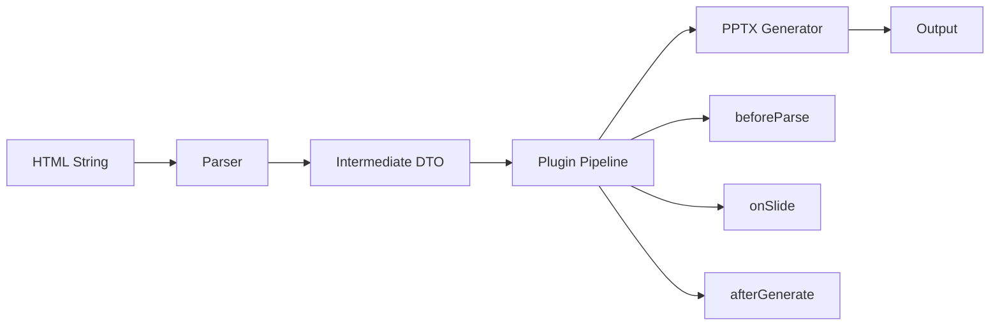
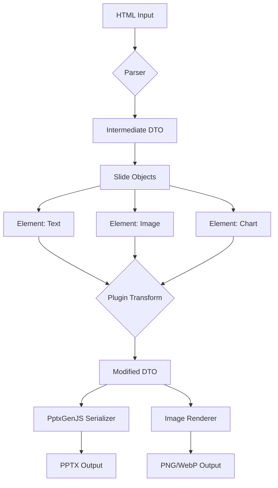
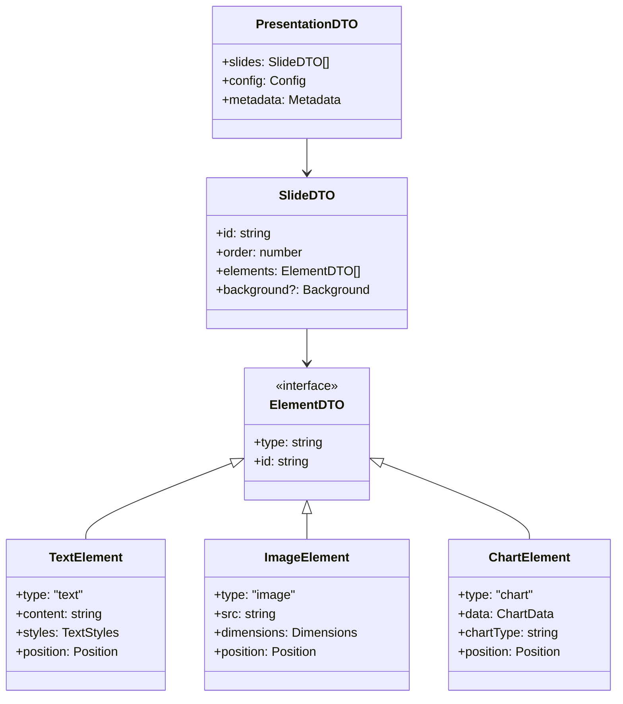

# html-in-pptx-out

Convert HTML to PowerPoint presentations with a flexible, plugin-based architecture.

## Features

- **HTML to PPTX Conversion** - Transform HTML documents into PowerPoint presentations
- **Plugin Architecture** - Extend functionality with custom plugins (fonts, styling, etc.)
- **Image Export** - Export individual slides as images (PNG, WebP)
- **Developer First** - Designed to work seamlessly with other integrations

## Installation

```bash
npm install html-in-pptx-out
```

## Quick Start

```typescript
import { HtmlToPptx } from "html-in-pptx-out";

const html = `
  <body>
    <div class="slide">
      <h1>My First Slide</h1>
      <p>Hello World!</p>
    </div>
  </body>
`;

const converter = new HtmlToPptx({
  slideSelector: ".slide",
});

await converter
  .load(html)
  .convert()
  .export({ format: "pptx", filename: "presentation.pptx" });
```

## Architecture

### Processing Pipeline

The library follows an immutable transformation pipeline with async plugin support:



### Data Flow



### Intermediate DTO Structure



## Design Decisions

### 1. Immutable Pipeline

- Each transformation step returns new data structures
- Prevents plugin interference and side effects
- Easier debugging and state inspection
- Supports async operations throughout

### 2. Dependency Injection via Config

- Simple config object pattern (not full DI container)
- Type-safe and explicit
- Easy to test and mock
- KISS

### 3. ESM-First with CJS Fallback

- Modern ESM as primary format
- CJS for backward compatibility
- Dual package exports for maximum compatibility
- Works in Node.js, browsers, and bundlers

### 5. Plugin Contract

- Async-first design
- Three lifecycle hooks: `beforeParse`, `onSlide`, `afterGenerate`
- Plugins work on clean DTO (not raw HTML or PPTX API)
- Immutable transforms ensure plugin composability

## Configuration

### Basic Config

```typescript
interface Config {
  slideSelector: string; // CSS selector for slide elements
  titleSelector?: string; // Optional title selector
  contentSelector?: string; // Optional content selector
  parser?: HTMLParser; // Custom HTML parser
  renderer?: PptxRenderer; // Custom PPTX renderer
}
```

### Plugin System

```typescript
interface Plugin {
  name: string;
  beforeParse?: (html: string, config: Config) => Promise<string> | string;
  onSlide?: (slide: SlideDTO, context: Context) => Promise<SlideDTO> | SlideDTO;
  afterGenerate?: (pptx: PptxGenJS, slides: SlideDTO[]) => Promise<void> | void;
}
```

### Example Plugin

```typescript
const customFontPlugin: Plugin = {
  name: "custom-fonts",
  onSlide: async (slide, context) => {
    return {
      ...slide,
      elements: slide.elements.map((el) => {
        if (el.type === "text") {
          return {
            ...el,
            styles: {
              ...el.styles,
              fontFace: "Custom Font",
            },
          };
        }
        return el;
      }),
    };
  },
};

const converter = new HtmlToPptx(config).use(customFontPlugin);
```

## API Reference

### HtmlToPptx Class

```typescript
class HtmlToPptx {
  constructor(config: Config);

  // Load HTML from string or file path
  load(input: string | HTMLSource): this;

  // Apply plugin
  use(plugin: Plugin): this;

  // Convert to intermediate DTO
  convert(): Promise<this>;

  // Export as PPTX
  export(options: ExportOptions): Promise<void>;

  // Export slides as images
  exportImages(options: ImageExportOptions): Promise<void>;

  // Get intermediate DTO for inspection
  getDTO(): PresentationDTO;
}
```

### Export Options

```typescript
interface ExportOptions {
  format: "pptx";
  filename: string;
  path?: string; // Optional output directory
}

interface ImageExportOptions {
  format: "png" | "webp";
  quality?: number;
  outputDir: string;
  naming?: (slideIndex: number) => string;
}
```

## Project Structure

```
html-in-pptx-out/
├── src/
│   ├── index.ts              # Main entry point
│   ├── core/                 # Core conversion logic
│   │   ├── parser.ts         # HTML parser
│   │   ├── converter.ts      # Main converter class
│   │   └── serializer.ts     # PPTX serializer
│   ├── lib/                  # Shared utilities
│   │   ├── dto.ts           # DTO definitions
│   │   └── plugin-manager.ts
│   ├── plugins/              # Built-in plugins
│   │   └── index.ts
│   ├── types/                # TypeScript types
│   │   ├── config.ts
│   │   ├── plugin.ts
│   │   └── dto.ts
│   └── utils/                # Helper functions
├── tests/                    # Test files
├── examples/                 # Usage examples
└── dist/                     # Build output
```

## Development

```bash
# Install dependencies
npm install

# Run in development mode
npm run dev

# Build
npm run build

# Run tests
npm test

# Type checking
npm run type-check
```

## License

MIT © Alden

## Acknowledgments

- Built with [pptxgenjs](https://github.com/gitbrent/PptxGenJS) for PPTX generation, shout out for laying groundwork for handling ooxml which is a nightmare
