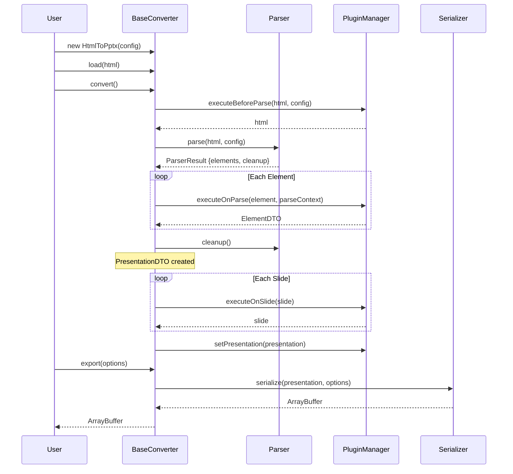
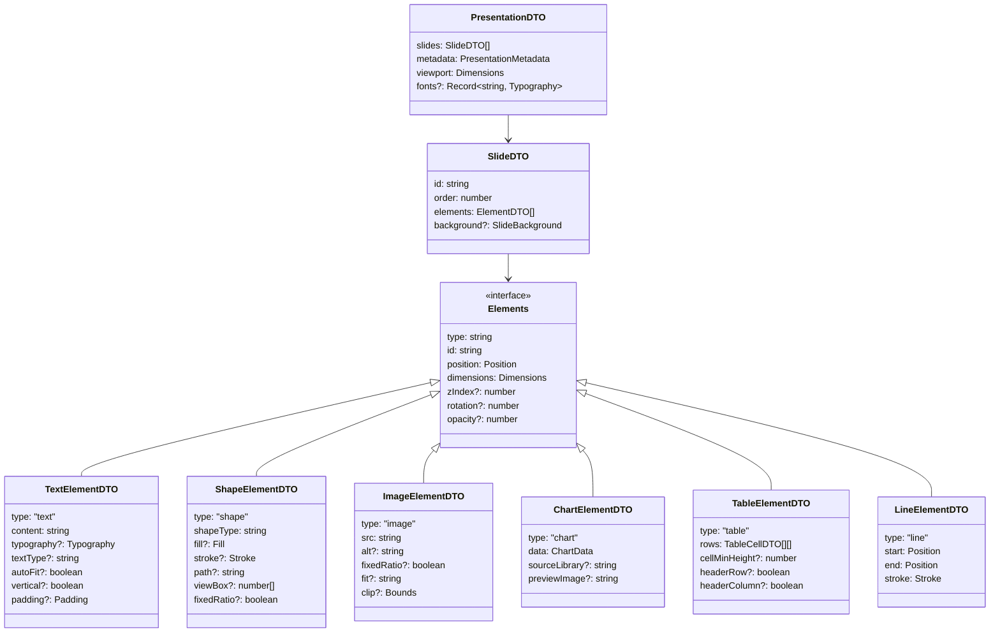

# html-in-pptx-out

Convert HTML to PowerPoint presentations with a flexible, plugin-based architecture.

## Features

- **HTML to PPTX Conversion** - Transform HTML documents into PowerPoint presentations
- **Plugin Architecture** - Extend functionality with custom plugins (fonts, styling, etc.)
- **Image Export** - Export individual slides as images (PNG, WebP)
- **Developer First** - Designed to work seamlessly with other integrations

## Installation

```bash
npm install html-in-pptx-out
```

## Quick Start

```typescript
import { HtmlToPptx } from "html-in-pptx-out";

const html = `
  <body>
    <div class="slide">
      <h1>My First Slide</h1>
      <p>Hello World!</p>
    </div>
  </body>
`;

const converter = new HtmlToPptx({
  selector: ".slide",
});

const buffer = await converter.load(html).convert().export({
  format: "pptx",
  filename: "presentation.pptx",
});
```

## Usage

**Test Page**

```bash
npm run build
npx serve .
```

or

```bash
npm run demo
```

Then open `http://localhost:3000/demo` in your browser.

## CLI

```bash
npx html-in-pptx-out <input.html> <output.pptx> [--selector <selector>]
```

**Options**

- `--selector <selector>` - CSS selector for slides (default: `.slide`)

**Examples**

```bash
npx html-in-pptx-out input.html output.pptx
npx html-in-pptx-out input.html output.pptx --selector .page
npx html-in-pptx-out slides.html presentation.pptx --selector "[data-slide]"
```

**Development**

```bash
npm run build
node dist/cli.js input.html output.pptx --selector .slide
```

## Architecture

### Processing Pipeline



### Data Flow


### DTO Structure



## Design Decisions

### 1. Strategy Pattern with DI

Swap Parser or Serializer without changing orchestration logic
Add or remove plugins without changing side-effects

- Parser and Serializer are injectable strategies
- BaseConverter orchestrates lifecycle, delegates to strategies
- Plugins are configurable
- HtmlToPptx provides sensible defaults

### 2. Single Responsibility Principle

- Parser: Extract DOM elements and metadata
- Serializer: Convert DTO to output format
- BaseConverter: Orchestrate lifecycle and plugin execution
- Plugins: Transform data at specific lifecycle points

### 3. Plugin Architecture

Four lifecycle hooks: `beforeParse`, `onParse`, `onSlide`, `afterGenerate`

`beforeParse`: executes after before processing DOM elements - modifies the DOM element
`onParse`: executes when parsing - dictates the outcome
`onSlide`: executes after parsing - modifies the slide DTO
`afterGenerate`: executes after serializing presentation - modifies how the binary looks

- `handles` for targeted element processing
- Plugins work on each data lifecycle
- Immutable transforms ensure composability

### 4. Deferred Execution

- Parser returns raw elements, not processed DTOs
- BaseConverter decides when to call plugins
- Clean separation between extraction and transformation
- Full control over execution flow

### 5. CLI compatible

- Use this as a standalone library through cli - useful for agentic tool-calls
- Works in Node.js, browsers, and bundlers

## Configuration

### Converter Config

```typescript
interface ConverterConfig {
  selector?: string;
  dimensions?: Dimensions;
  plugins?: PluginsConfig;
  parser?: ParserStrategy;
  serializer?: SerializerStrategy;
}

interface PluginsConfig {
  core?: Plugin[];
  extensions?: Plugin[];
}
```

### Strategy Interfaces

```typescript
interface ParserElement {
  slideIndex: number;
  element: HTMLElement;
  parseContext: ParseContext;
}

interface ParserResult {
  elements: ParserElement[];
  cleanup: () => void;
}

interface ParserStrategy {
  parse(html: string, config: ParserConfig): Promise<ParserResult>;
}

interface SerializerStrategy {
  serialize(
    presentation: PresentationDTO,
    options: ExportConfig,
  ): Promise<ArrayBuffer>;
}
```

### Export Config

```typescript
interface ExportConfig {
  format: "pptx";
  filename: string;
  path?: string;
  compression?: boolean;
}

interface ImageExportConfig {
  format: "png" | "webp" | "jpg";
  quality?: number;
  output: {
    directory: string;
    naming?: (index: number, id: string) => string;
  };
  dimensions?: {
    width: number;
    height: number;
  };
}
```

### Plugin Contract

```typescript
type ElementType = "text" | "image" | "shape" | "chart" | "table" | "line";

interface ParseContext {
  elementType: ElementType;
  tagName: string;
  computedStyle: CSSStyleDeclaration;
  boundingRect: DOMRect;
  slideIndex: number;
  slideElement: HTMLElement;
}

interface Plugin {
  name: string;
  version?: string;
  handles?: ElementType[];
  beforeParse?: (
    html: string,
    config: ParserConfig,
    context: PluginContext,
  ) => Promise<string> | string;
  onParse?: (
    element: HTMLElement,
    parseContext: ParseContext,
    pluginContext: PluginContext,
  ) => Promise<ElementDTO | null> | ElementDTO | null;
  onSlide?: (
    slide: SlideDTO,
    context: PluginContext,
  ) => Promise<SlideDTO> | SlideDTO;
  afterGenerate?: (
    pptx: PptxGenJS,
    presentation: PresentationDTO,
    context: PluginContext,
  ) => Promise<void> | void;
}

interface PluginContext {
  presentation?: PresentationDTO;
  metadata: Record<string, unknown>;
  state: Map<string, unknown>;
}
```

### Example Plugin

```typescript
const textParserPlugin: Plugin = {
  name: "text-parser",
  handles: ["text"],
  onParse: (element, parseContext, pluginContext) => {
    const { computedStyle, boundingRect } = parseContext;

    return {
      type: "text",
      id: crypto.randomUUID(),
      content: element.textContent || "",
      position: {
        left: boundingRect.left,
        top: boundingRect.top,
      },
      dimensions: {
        width: boundingRect.width,
        height: boundingRect.height,
      },
      typography: {
        fontFamily: computedStyle.fontFamily,
        fontSize: parseFloat(computedStyle.fontSize),
        color: computedStyle.color,
      },
    };
  },
};

const customFontPlugin: Plugin = {
  name: "custom-fonts",
  onSlide: async (slide, context) => {
    return {
      ...slide,
      elements: slide.elements.map((el) => {
        if (el.type === "text") {
          return {
            ...el,
            typography: {
              ...el.typography,
              fontFamily: "Custom Font",
            },
          };
        }
        return el;
      }),
    };
  },
};

const converter = new HtmlToPptx(config)
  .use(textParserPlugin)
  .use(customFontPlugin);
```

## API Reference

### BaseConverter

```typescript
class BaseConverter {
  constructor(config: ConverterConfig);

  load(input: string | HTMLSource): this;
  use(plugin: Plugin): this;
  convert(): Promise<this>;
  export(options: ExportConfig): Promise<ArrayBuffer>;
  exportImages(options: ImageExportConfig): Promise<void>;
  getPresentation(): PresentationDTO;
}
```

### HtmlToPptx Class

```typescript
class HtmlToPptx extends BaseConverter {
  constructor(config?: Partial<ConverterConfig>);
}
```

### Built-in Strategies

```typescript
class IframeParser implements ParserStrategy {
  parse(html: string, config: ParserConfig): Promise<ParserResult>;
}

class PptxSerializer implements SerializerStrategy {
  serialize(
    presentation: PresentationDTO,
    options: ExportConfig,
  ): Promise<ArrayBuffer>;
}
```

### PluginManager

```typescript
class PluginManager {
  register(plugin: Plugin): void;
  unregister(name: string): void;
  getPlugins(): Plugin[];
  setPresentation(presentation: PresentationDTO): void;
  executeBeforeParse(html: string, config: ParserConfig): Promise<string>;
  executeOnParse(
    element: HTMLElement,
    parseContext: ParseContext,
  ): Promise<ElementDTO | null>;
  executeOnSlide(slide: SlideDTO): Promise<SlideDTO>;
  executeAfterGenerate(
    pptx: PptxGenJS,
    presentation: PresentationDTO,
  ): Promise<void>;
}
```

PluginManager owns and manages `PluginContext` internally. Plugins receive context from the manager, not from callers.

## Project Structure

```
html-in-pptx-out/
├── src/
│   ├── index.ts
│   ├── constants.ts
│   ├── cli.ts
│   ├── core/
│   │   ├── base-converter.ts
│   │   └── converter.ts
│   ├── parsers/
│   │   └── iframe.ts
│   ├── serializers/
│   │   └── pptx.ts
│   ├── lib/
│   │   ├── plugin-manager.ts
│   │   ├── iframe-renderer.ts
│   │   └── extractors/
│   │       ├── classifier.ts
│   │       ├── typography.ts
│   │       └── position.ts
│   ├── plugins/
│   │   └── core/
│   │       ├── index.ts
│   │       └── text.ts
│   ├── types/
│   │   ├── base.types.ts
│   │   ├── elements.types.ts
│   │   ├── presentation.types.ts
│   │   ├── config.types.ts
│   │   └── plugin.types.ts
│   └── utils/
│       ├── assert.ts
│       └── sanitize.ts
├── tests/
├── examples/
└── dist/
```

## Development

```bash
npm install
npm run build
npm run type-check
npm test
```

## License

MIT © christphralden

## Acknowledgments

- Built with [pptxgenjs](https://github.com/gitbrent/PptxGenJS) for PPTX generation, shout out for laying groundwork for handling ooxml which is a nightmare
