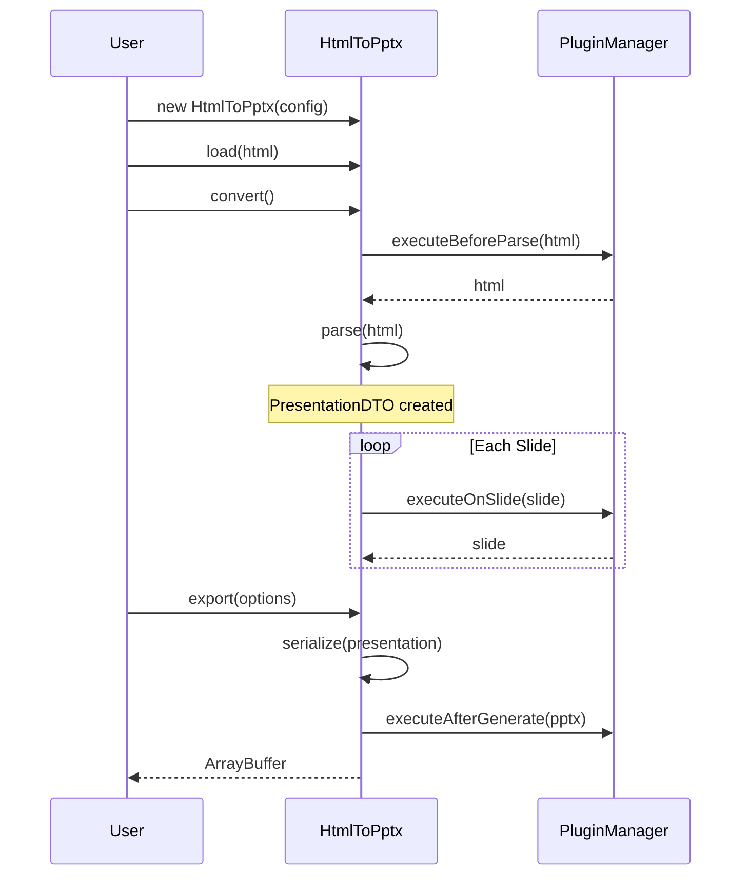
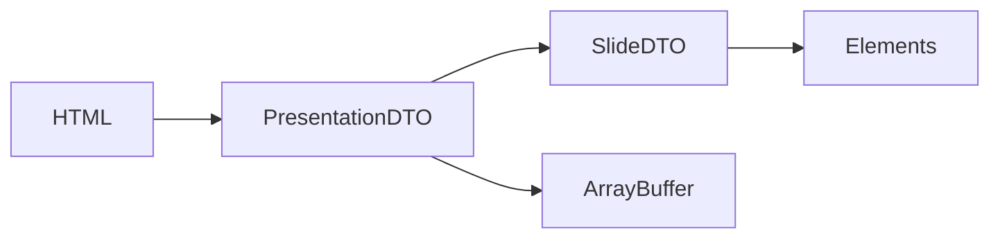

# html-in-pptx-out

Convert HTML to PowerPoint presentations with a flexible, plugin-based architecture.

## Features

- **HTML to PPTX Conversion** - Transform HTML documents into PowerPoint presentations
- **Plugin Architecture** - Extend functionality with custom plugins (fonts, styling, etc.)
- **Image Export** - Export individual slides as images (PNG, WebP)
- **Developer First** - Designed to work seamlessly with other integrations

## Installation

```bash
npm install html-in-pptx-out
```

## Quick Start

```typescript
import { HtmlToPptx } from "html-in-pptx-out";

const html = `
  <body>
    <div class="slide">
      <h1>My First Slide</h1>
      <p>Hello World!</p>
    </div>
  </body>
`;

const converter = new HtmlToPptx({
  selector: ".slide",
});

const buffer = await converter.load(html).convert().export({
  format: "pptx",
  filename: "presentation.pptx",
});
```

## Usage

**Test Page**

```bash
npm run build
npx serve .
```

or

```bash
npm run demo
```

Then open `http://localhost:3000/demo` in your browser.

## CLI

```bash
npx html-in-pptx-out <input.html> <output.pptx> [--selector <selector>]
```

**Options**

- `--selector <selector>` - CSS selector for slides (default: `.slide`)

**Examples**

```bash
npx html-in-pptx-out input.html output.pptx
npx html-in-pptx-out input.html output.pptx --selector .page
npx html-in-pptx-out slides.html presentation.pptx --selector "[data-slide]"
```

**Development**

```bash
npm run build
node dist/cli.js input.html output.pptx --selector .slide
```

## Architecture

### Processing Pipeline



### Data Flow



### DTO Structure


## Design Decisions

### 1. Immutable Pipeline

- Each transformation step returns new data structures
- Prevents plugin interference and side effects
- Easier debugging and state inspection
- Supports async operations throughout

### 2. Plugin Contract

- Async-first design
- Three lifecycle hooks: `beforeParse`, `onSlide`, `afterGenerate`
- Plugins work on clean DTO (not raw HTML or PPTX API)
- Immutable transforms ensure plugin composability

### 3. Dependency Injection via Config

- Simple config object pattern (not full DI container)
- Type-safe and explicit
- Easy to test and mock
- KISS

### 4. ESM-First with CJS Fallback

- Modern ESM as primary format
- CJS for backward compatibility
- Dual package exports for maximum compatibility
- Works in Node.js, browsers, and bundlers

## Configuration

### Parser Config

```typescript
interface ParserConfig {
  selector: string;
  dimensions: {
    width: number;
    height: number;
  };
}
```

### Export Config

```typescript
interface ExportConfig {
  format: "pptx";
  filename: string;
  path?: string;
  compression?: boolean;
}

interface ImageExportConfig {
  format: "png" | "webp" | "jpg";
  quality?: number;
  output: {
    directory: string;
    naming?: (index: number, id: string) => string;
  };
  dimensions?: {
    width: number;
    height: number;
  };
}
```

### Plugin Contract

```typescript
interface Plugin {
  name: string;
  version?: string;
  beforeParse?: (
    html: string,
    config: ParserConfig,
    context: PluginContext,
  ) => Promise<string> | string;
  onSlide?: (
    slide: SlideDTO,
    context: PluginContext,
  ) => Promise<SlideDTO> | SlideDTO;
  afterGenerate?: (
    pptx: PptxGenJS,
    presentation: PresentationDTO,
    context: PluginContext,
  ) => Promise<void> | void;
}

interface PluginContext {
  presentation?: PresentationDTO;
  metadata: Record<string, unknown>;
  state: Map<string, unknown>;
}
```

### Example Plugin

```typescript
const customFontPlugin: Plugin = {
  name: "custom-fonts",
  onSlide: async (slide, context) => {
    return {
      ...slide,
      elements: slide.elements.map((el) => {
        if (el.type === "text") {
          const text = el as TextElementDTO;
          return {
            ...text,
            typography: {
              ...text.typography,
              fontFamily: "Custom Font",
            },
          };
        }
        return el;
      }),
    };
  },
};

const converter = new HtmlToPptx(config).use(customFontPlugin);
```

## API Reference

### BaseConverter

```typescript
abstract class BaseConverter {
  constructor(config?: Partial<ParserConfig>);

  load(input: string | HTMLSource): this;
  use(plugin: Plugin): this;
  convert(): Promise<this>;
  export(options: ExportConfig): Promise<ArrayBuffer>;
  exportImages(options: ImageExportConfig): Promise<void>;
  getPresentation(): PresentationDTO;

  protected abstract parse(html: string): Promise<PresentationDTO>;
  protected abstract serialize(
    presentation: PresentationDTO,
    options: ExportConfig,
  ): Promise<ArrayBuffer>;
}
```

### HtmlToPptx Class

```typescript
class HtmlToPptx extends BaseConverter {
  constructor(config?: Partial<ParserConfig>);
}
```

## Project Structure

```
html-in-pptx-out/
├── src/
│   ├── index.ts
│   ├── constants.ts
│   ├── cli.ts
│   ├── core/
│   │   ├── base-converter.ts
│   │   └── converter.ts
│   ├── lib/
│   │   └── plugin-manager.ts
│   ├── plugins/
│   │   └── index.ts
│   ├── types/
│   │   ├── base.types.ts
│   │   ├── elements.types.ts
│   │   ├── presentation.types.ts
│   │   ├── config.types.ts
│   │   └── plugin.types.ts
│   └── utils/
│       └── assert.ts
├── tests/
├── examples/
└── dist/
```

## Development

```bash
npm install
npm run build
npm run type-check
npm test
```

## License

MIT © christphralden

## Acknowledgments

- Built with [pptxgenjs](https://github.com/gitbrent/PptxGenJS) for PPTX generation, shout out for laying groundwork for handling ooxml which is a nightmare
